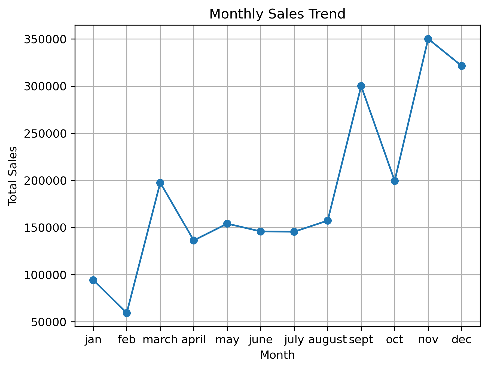
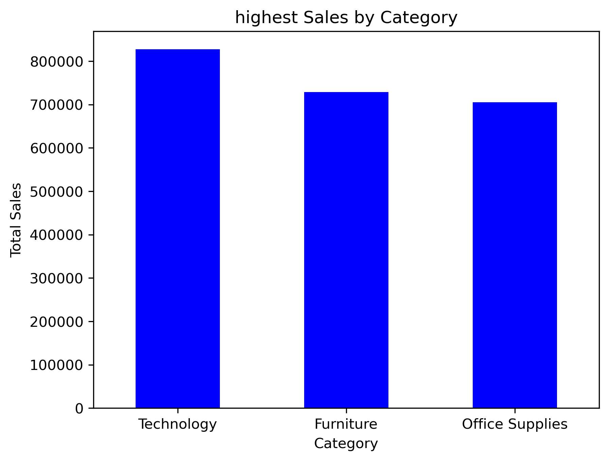
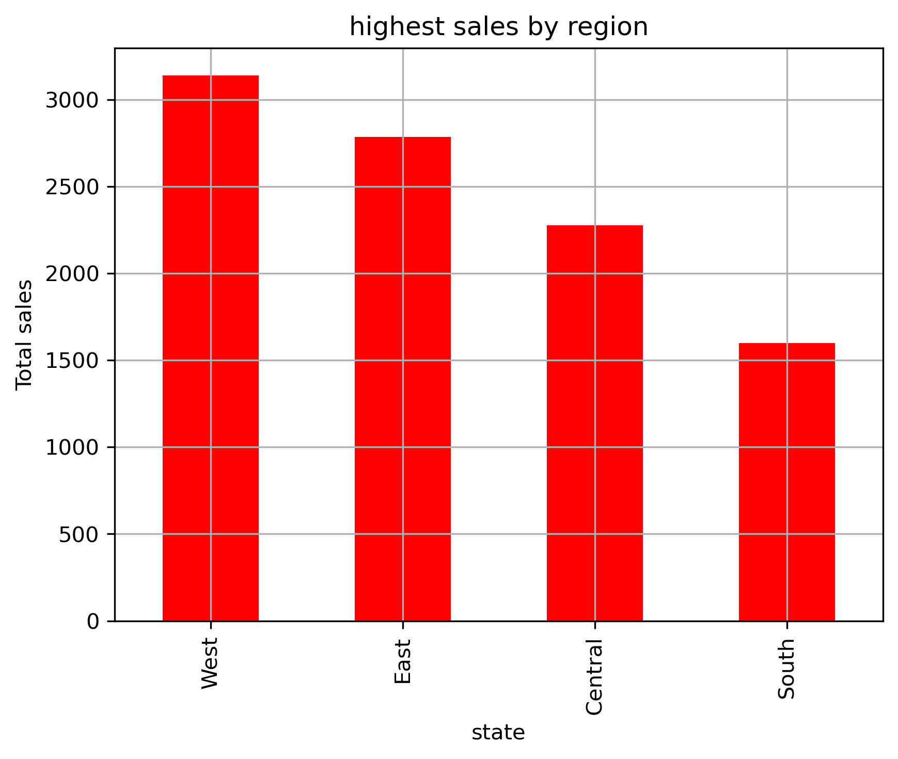
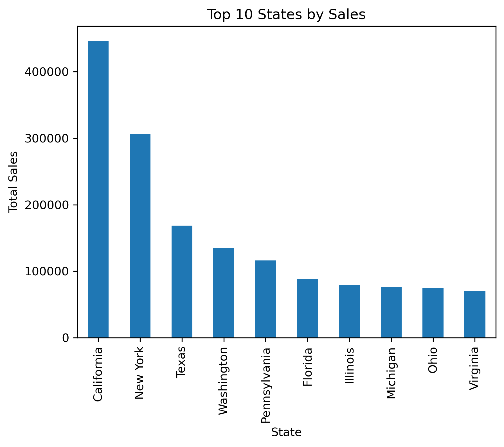

# Superstore Sales EDA

A beginner-friendly exploratory data analysis (EDA) project built to practice data cleaning, analysis, and visualization using the Superstore sales dataset.

## Objective
To learn the full EDA workflow: loading data, cleaning it, exploring patterns, and presenting findings through charts.

## Skills Practiced
- Data cleaning (handling missing values, duplicates, data types)
- Date handling and feature creation (month, year)
- Grouping and aggregating data with Pandas
- Data visualization with Matplotlib and Seaborn
- Writing clear, reproducible analysis in Jupyter Notebook
- Using Git and GitHub for version control

## Tools Used
- Python
- Pandas
- Matplotlib
- Seaborn
- Jupyter Notebook

## Selected Visualizations

### Monthly Sales Trend

### Sales by Category

### Sales by Region

### Top 10 States by Sales

## Project Structure
- `data/` – raw and cleaned datasets
- `notebooks/` – analysis notebook

## What I Learned
- How to clean and prepare a raw dataset before analysis
- How to ask questions of data (sales by category, region, segment, time)
- How to choose the right chart for each type of question
- How to organize a project folder and publish it on GitHub

## How to Run
1. Clone this repository
2. Install the required libraries: `pip install pandas matplotlib seaborn jupyter`
3. Open the notebook in the `notebooks/` folder and run all cells